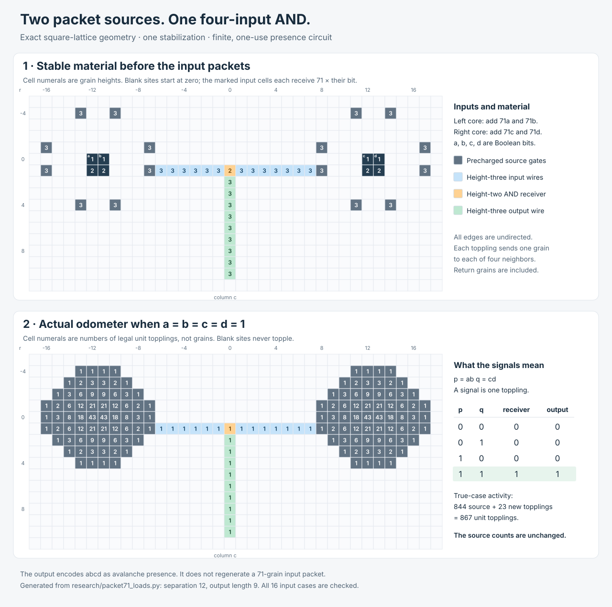

# Sandpiles

Open, AI-produced research on unconventional computation in the ordinary
two-dimensional Abelian sandpile.

**Start here:** [the research guide](research/README.md) explains the model,
the results, what is classical, and what remains open. It includes a claim
map linking each statement to its proof and executable evidence.

To reproduce the maintained witnesses and current audit records with only
Python 3.10 or newer:

```sh
python3 research/reproduce.py
```

Add `--lean` to check the four new operational theorems with the pinned
Lean 4.27.0 compiler. The command preserves the checked-in evidence and fails
if newly generated audit records differ. See [contributing](CONTRIBUTING.md)
for ways to check, explain, extend, or challenge the work.

## Current results

### October 2026: an exact interface limit and safe physical composition

A stable passive attachment cannot topple more times than the maximum count
at its complete incoming boundary. In particular, one-toppling fuse outputs
cannot passively regenerate a 71-grain packet while retaining that interface
contract. Even delivery through all four neighboring cells requires some
boundary site to topple at least 18 times. This is an application of the
classical sandpile wave principle, now stated explicitly for the repository's
interface problem and [checked in Lean](formal/passive-load/README.md).

The constructive route is to compose the presence outputs directly:

- An exact certificate checks legal once-each activity **and** final stability,
  including every affected exterior cell.
- Packet-71 outputs can drive specified branches, loops, and an isolated
  rectangular receiver containing **any stable height pattern**, without
  changing the source odometer.
- Two packet-71 gates feed a conventional height-two receiver to compute
  `a AND b AND c AND d` in one stabilization. Its output wire may have any
  positive finite length; every output cell topples exactly once iff all four
  inputs are true.



Read the [passive-bound proof](research/passive_amplification.md),
[load and composition proofs](research/packet71_loads.md), and
[small feedback counterexample](research/amplifier_findings.md).
The exact composition and general receiver region extend the previously
unloaded interface. They do not establish a packet-to-packet cascade,
reusability, a crossover, or universality. The classical primitives are
credited; no claim of literature priority is made.

### Packet 71: local parity AND and an eight-terminal transducer

From the stable core

```text
1 1
2 2
```

add `71a` and `71b` grains at the two top cells. For every
`a,b in {0,1,2,3}`, two exterior sites have odometer parity

```text
(a mod 2) AND (b mod 2).
```

An exhaustive audit of all 256 stable `2 x 2` cores, every common packet
`1 <= p <= 71`, all sixteen inputs, and every reached exterior site finds no
such tap below 71 and exactly sixteen at 71.

The Boolean restriction supplies an exact hybrid interface. Eight initially
empty boundary cells receive exactly one grain iff `a=b=1`, without toppling.
Precharge those cells and arbitrary prescribed finite outward fuse leads to
height three before supplying the inputs. In the three false cases no
terminal or fuse cell topples; in the true case every terminal and fuse cell
topples exactly once. This is a one-stabilization,
packet-input/presence-output one-shot AND module with eight unloaded
terminals and no separate read pulse.

Fuse signaling, presence-AND, and branching are classical sandpile-circuit
ingredients. The result here is the exact certified packet-to-presence
interface. Its one-toppling output encoding does not match its 71-grain input
encoding, so self-cascade and arbitrary downstream loading are not claimed.

See [the packet-71 audit](sandpile_packet71_and_latch_audit.md), its independent
Python certificate, and the independent C++ exhaustive audit.

### Packet 672: a local odometer-residue half-adder

From the stable core

```text
0 3
3 2
```

add `672a` and `672b` grains at the two top cells. At the exterior sites
`SUM=(-3,3)` and `CARRY=(-1,3)`,

```text
u(SUM)   mod 2 = (a mod 2) XOR (b mod 2)
u(CARRY) mod 2 = (a mod 2) AND (b mod 2)
```

for all sixteen `a,b in {0,1,2,3}`. Thus the two taps form a half-adder of
the input parity bits over a four-symbol packet-multiplicity alphabet; this
is not a base-four adder. Two independent exhaustive engines find no such
two-tap half-adder in the same 256-core, equal-packet class below 672; at 672
there are ten cores and 28 role-labelled output pairs.

This is a decisive nonlinear two-output local observable, but its integer
output counts are not yet normalized packets and attaching a receiver can
feed back into the same avalanche. See
[the packet-672 audit](sandpile_halfadder672_audit.md).

### Packet 925: a crossed parity identity

The repository began with an exact four-terminal odometer-parity identity
on the infinite square lattice. From the stable `2 x 2` seed

```text
0 0
2 2
```

add `925a` and `925b` grains at the two top cells, with
`a,b in {0,1,2,3}`. After stabilization, the odometer parities at the
oppositely paired bottom cells are exactly `(a mod 2, b mod 2)` for all
sixteen inputs.

This is a crossed local readout, not yet a classical composable crossing
gate. The distinction, exact table, scoped minimality result, analytic
no-propagation theorem, literature context, and failed composition audits
are in the paper:

**[A Four-Terminal Odometer-Parity Identity in the Planar Abelian
Sandpile](paper/four_terminal_odometer_parity_identity.pdf)**

## Contribution statement

OpenAI Codex produced the specific construction, searches, proofs, code,
verification, literature framing, and manuscript in a ChatGPT work session
on 23 July 2026. The October 2026 continuation, including its proofs,
independent audits, and contributor-facing documentation, was also produced
by OpenAI Codex. Sophie additionally emphasized making the work understandable,
reproducible, and useful as a public foundation for others.

Sophie (`heartpunk`) had not encountered this sandpile problem before that
session. Her contribution was to pose a broad challenge, filter proposed
directions by whether they seemed interesting, encourage the system to keep
trying, request a publishable write-up, and make the work public. She did not
derive or independently verify the technical results.

Hosting this repository under `heartpunk` denotes publication stewardship,
not technical authorship. The technical claims are unreviewed AI-produced
research and should be checked independently.

## Reproduce the results

The packet-71 certificates and scoped exhaustive audit:

```bash
python3 generate_packet71_and_latch_certificate.py
python3 verify_packet71_and_latch_certificate.py

c++ -O3 -std=c++20 sandpile_packet71_and_latch_audit.cpp -o audit71
./audit71 packet71_and_latch_cpp_audit.json
```

The packet-672 half-adder certificates and two independent scoped exhaustive
audits:

```bash
python3 generate_halfadder672_certificate.py
python3 verify_halfadder672_certificate.py

c++ -O3 -std=c++20 audit_halfadder672_exhaustive.cpp -o audit672
./audit672

c++ -O3 -std=c++20 audit_halfadder672_unit_exhaustive.cpp -o audit672-unit
./audit672-unit
```

The original packet-925 checks require only Python 3:

```bash
python3 verify_packet925_full_alphabet_certificate.py
python3 audit_full_alphabet_925_witness.py
```

The scoped minimality audit requires a C++20 compiler:

```bash
c++ -O3 -std=c++20 audit_full_alphabet_925.cpp -o audit925
./audit925 --maximum-pulse 925
```

The exact packet-family scan through `100000` is:

```bash
c++ -O3 -std=c++20 -pthread scan_full_alphabet_0022.cpp -o scan100k
./scan100k --maximum-pulse 100000
```

The PDF also embeds its certificate, verifiers, proof notes, scan audit, and
typesetting source as file attachments.

## Repository contents

The root intentionally preserves the research scripts and their relative
imports. It includes:

- exact certificates and independent verifiers;
- dense and sparse exhaustive searches;
- packet-family scans and replay audits;
- analytic no-go proofs;
- parity-wire, normalizer, reset, and interface experiments;
- bounded negative composition results;
- exploratory Python, C++, Z3, and JavaScript programs.

The unsuccessful searches are included because they delimit the result and
make the path to later claims auditable.

## Ongoing direction

Further work will be committed publicly. The immediate target is to close the
encoding gap between packet inputs, parity observables, and ordinary fuse-wire
outputs without losing exactness under physical attachment. The passive-bound
theorem now rules out doing this by a stable amplifier that preserves a
one-toppling interface; direct presence composition is a demonstrated route
around that particular requirement. The [open questions](research/README.md#open-questions)
identify work that remains meaningful under this obstruction. No claim of
functional completeness, a crossover gate, P-completeness, or universality is
made.

## License

Use this however you want.

Everything in the repository is released under
[CC0-1.0](LICENSE-CC0): use, copy, modify, publish, redistribute, sell, or
build on it for any purpose. Attribution is appreciated but not required.

Source code is additionally available under the [MIT License](LICENSE).
You may choose either license for code.
